  <picture>
    <source media="(prefers-color-scheme: dark)" srcset="assets/banner-dark.svg">
    
  </picture>

 

Full-stack engineer who started in the front end and followed the data all the way down: React and TypeScript interfaces, FastAPI and PostgreSQL services, LLM and RAG systems, and the unglamorous parts that make them trustworthy (evals, rate limits, observability, cost controls). 1.7 years of shipping real things, and contributing to open source along the way.

 

## The build path

  <picture>
    <source media="(prefers-color-scheme: dark)" srcset="assets/path-dark.svg">
    
  </picture>

 

## Featured

| Project | What it is | Links |
| :--- | :--- | :--- |
| **RAG X-ray** | See why a RAG system answers, or refuses. Every chunk scored against the question, the refusal threshold drawn on the chart, and whether the model was called at all. React, TypeScript, Zustand and TanStack Query front end with design tokens and automated accessibility tests; FastAPI back end on Azure OpenAI and Azure AI Search hybrid retrieval, with an eval harness, rate limits, a daily token budget and a kill switch. | [Live demo](https://rag-xray.agreeablesky-d286d090.centralus.azurecontainerapps.io) · [Code](https://github.com/Nischalgouda/rag-with-azure-openai) |
| **FlowForge** | A visual builder for LLM pipelines: drag nodes, wire them up, press Run and watch each step execute live. React, ReactFlow and Zustand front end; a FastAPI engine validates the graph, runs it in topological order and streams progress over server-sent events. Gemini and Claude behind a provider adapter. | [Live](https://flow-forge-liard.vercel.app/) |
| **ZiniosEdge Invoice Portal** | Production multi-tenant SaaS on an 8-service Docker Compose stack: ASP.NET Core 9, JWT and RBAC, EF Core and PostgreSQL, React 19 and TypeScript, SignalR, Prometheus and Grafana, SSL-terminated Nginx. Also shipped an AI chatbot into the HR portal on an OpenRouter free-model fallback chain, at $0 LLM cost. | Production (private) |
| **Affordra** | A financial agent, in active development. | In progress |

 

## How I think

- **Measure, then fix the cause.** Traced requests took 7 to 9 seconds. Running three independent search queries concurrently and reusing HTTP clients brought refusals to about 1 to 2 seconds and answers to about 3 to 5.
- **Calibrate, don't guess.** A refusal threshold that was right at 0.52 for one embedding model was 0.23 for another. An evaluation set caught it; intuition didn't.
- **Defense in depth.** A similarity guardrail, a grounded prompt, rate limits that can't be dodged by forging a header, a daily token budget and a kill switch.
- **Own the whole path.** From the React state store to the Docker image, CI and a repeatable Azure deploy, and say plainly which part isn't done yet.

## Stack

| | |
| :--- | :--- |
| **Front-end** | React 19 · TypeScript · Zustand · TanStack Query · ReactFlow · Tailwind · Vite · Vitest |
| **Back-end** | Python (primary) · FastAPI · Flask · C# ASP.NET Core · REST · PostgreSQL · SQL |
| **AI / LLM** | Azure OpenAI · Azure AI Search · LiteLLM · Gemini · MCP · RAG and evals |
| **Cloud / DevOps** | Azure · Docker · GitHub Actions · Prometheus · Grafana · Nginx |
| **Tools** | Claude Code · Cursor · Git |

## Off the clock, same instincts at work

| Outside the editor | At work |
| :--- | :--- |
|  **Guitar** | Scales first, then improvise. Same with algorithm patterns and system design. |
|  **Biking** | Gear check before every ride and the helmet always on: tests, health checks and guardrails. |
|  **Sekiro** | Posture, not health, decides the fight. Latency is the same: it's rarely the number you were watching. |
|  **Marvel Rivals** | Team composition wins. No service carries alone; each has a clear role. |
|  **Pokémon** | Type matchups are tool choice. Hybrid search is a dual-type move: vector plus keyword. |
|  **Grand Blue** | Dive in headfirst, laugh at the chaos, and always keep a rollback plan. |
|  **Sons of Anarchy** | A club runs on rules and loyalty. Mine has rate limits, admin keys and a kill switch. |
|  **One Piece** | Sail to the next island. Big goals ship as small, finished milestones: an API, then a UI, then a hosted demo. |
|  **Fashion** | Fit and finish. I care about spacing and type the way I care about tailoring. |

## Right now

- Shipping **RAG X-ray** in public and writing up what broke along the way (a retired model, a quota of zero, a refusal threshold that moved between embedding models).
- Contributing to **LiteLLM**.
- Going deeper on production system design: caching, queues, auth and observability, plus evaluation and monitoring for RAG.

 

Fun fact: ask my RAG demo who I am and it will tell you it doesn't know. That's the guardrail working as designed.
